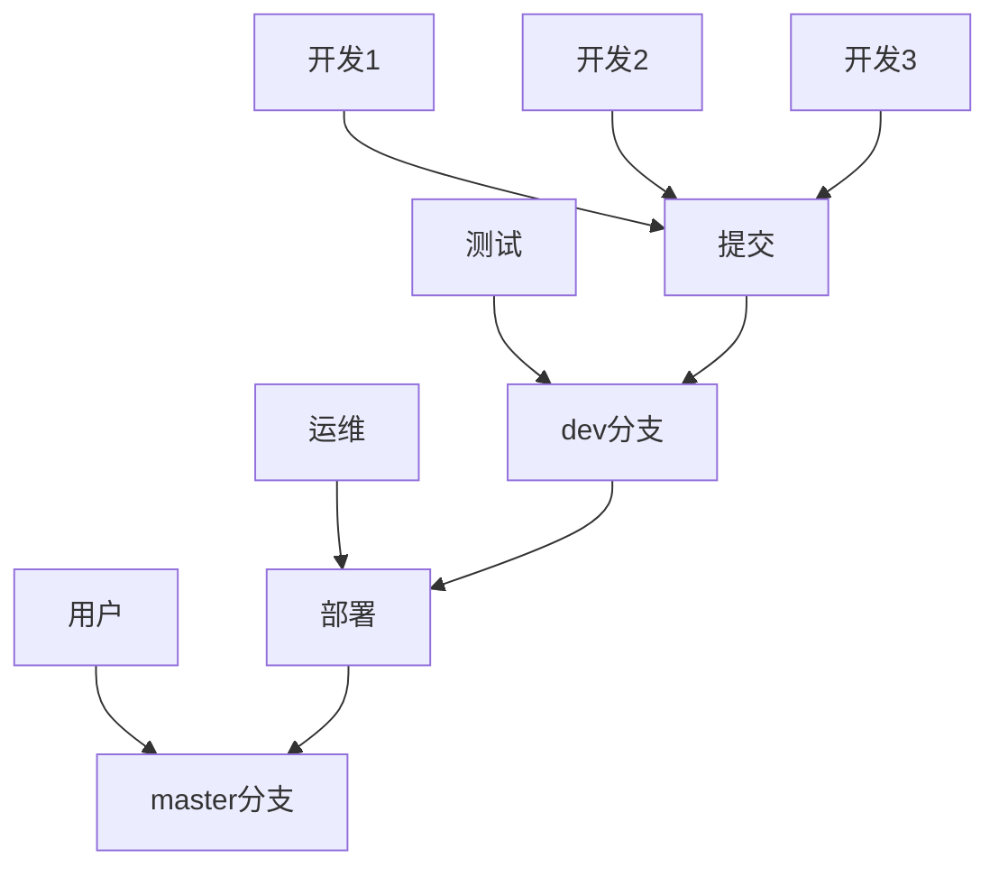

### 1 Git

#### 1.1 Git Basic

* `git init`	初始化本地git仓库（生成.git文件夹）
* `git config [--global] user.{name, email}`	设置用户（全局）签名
* `git status`	查看git状态
* `git add <file>`	添加文件至暂存区
* `git rm --cached <file>`	从暂存区删除文件
* `git commit -m <"message">`	提交当前版本
* `git log/reflog`	查看版本记录
* `git reset --hard <version>`	穿越到历史版本

#### 1.2 Git Branch

* `git branch -v`	查看当前所在的分支
* `git branch <name>`	创建分支 
* `git checkout <branch>`	切换分支
* `git merge <branch>`	合并branch分支到当前分支 

#### 1.3 Git Teamwork

* `git remote`
  * `git remote add <name> <giturl>`	可以为当前远程库的链接创建别名
  * `git remote -v`	可以查看当前有哪些别名
* `git push <repository> <branch>`     推送本地库到远程
* `git pull <repository> <branch>`     从远程拉取分支到本地库
* `git clone <giturl>`    会拉取代码，初始化本地库并且创建别名

