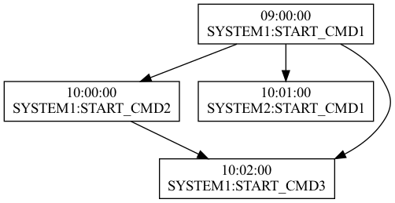

## DrawTOP

#### 0 概要

TOP交易操控终端通过读取`Common/config/`目录下的`*.cfg`文件，在操控网页端形成各系统的操作界面。目前TOP系统存在以下问题，令各系统开发人员头疼不已：

1. 系统内指令没有根据依赖顺序展示在界面中；
2. 依赖关系隐藏于配置文件中，不能清晰直观地供运维人员观察；
3. 调整某一指令自动化时间时，需要查看所有前置依赖关系才能评估影响。

考虑到以上问题，拟开发一个小工具，自动化地收集各系统配置文件中的依赖关系，并按照指令的启动时间顺序生成一张图，供相关人员参考。


#### 1 开发环境

##### 1.1 Graphviz

[Graphviz](http://www.graphviz.org/)是一款开源图可视化软件：

```shell
brew install graphviz
```

##### 1.2 Environment

* macOS Monterey v12.6

* Python 3.8.3
* PyCharm 2021.3.2 (Community Edition)

* graphviz

```shell
pip install graphviz
```

> Name: graphviz
>
> Version: 0.20.1
>
> Summary: Simple Python interface for Graphviz
>
> Home-page: https://github.com/xflr6/graphviz
>
> Author: Sebastian Bank
>
> Author-email: sebastian.bank@uni-leipzig.de
>
> License: MIT
>
> Location: /Users/kaisyouu/anaconda3/lib/python3.8/site-packages
>
> Requires: 
>
> Required-by: 


#### 2 设计思路

##### 2.1 预期效果



如上图，预期将所有系统配置的指令按照上图形式展现。

##### 2.2 可视化原理

经实践，通过python编写代码，可以调用graphviz工具生成.gv格式的dot脚本，再由此生成可视化的图片。

Python代码如下（test.py）

```python
from graphviz import Digraph

dot = Digraph('Test')
dot.node("1", "Life's too short")
dot.node("2", "I learn Python")
dot.edge('1', '2')

dot.view()
```

生成的dot脚本（Test.gv）

```
digraph Test {
	1 [label="Life's too short"]
	2 [label="I learn Python"]
	1 -> 2
}
```

生成的图片（Test.gv.pdf）


##### 2.3 数据结构

了解graphviz的原理之后，计划通过python程序读取配置文件，并将配置中每一个CMD指令构建为一个图节点，每个图节点具有以下属性：

1. 所属系统
2. 指令名称
3. 启动时间
4. 依赖指令

已知依赖：

1. 每个系统名称不同，但指令名称有可能相同
2. 每条指令的依赖可能为多个

根据以上约束，单个节点的数据结构如下：

```python
class ListNode():
    def __init__(self, cmd="", time="", prev=None):
        self.cmd = cmd		// 所属系统:指令
        self.time = time	// HH:MM:SS
        self.prev = prev	// list of cmd

```

采用所属系统和指令字符串拼接组成cmd，可以保证不重复，采用字典（哈希）来保存节点：

```python
dict[cmd]=Listnode
```

#### 3 版本设计

##### 3.1 v1.0

1. 数据结构

   1. `Listnode`指令

      ```mermaid
      classDiagram
      	class Listnode{
      		int id
      		string cmd
      		string time
      		string[] prev
      	}
      ```

      

   2. `cmd_dict`指令字典

      ```mermaid
      graph LR;
      	id-->Listnode
      ```

   3. `active_node_dict`活跃节点字典

      ```mermaid
      graph LR;
      	id-->is_active
      ```

   4. `id_dict`指令id字典

      ```mermaid
      graph LR;
      	cmd-->id
      ```

      

2. 程序流程

   1. 逐行遍历所有配置文件，找到以CMD开头的行，按照编号加入指令字典，同时维护活跃节点字典和指令id字典
   2. 再次逐行遍历所有配置文件，找到以DEPEND开头的行，将每条指令的依赖指令id加入该指令的依赖数组中，同时使得被依赖项在活跃节点字典的状态为活跃
   3. 遍历指令字典中所有指令，画出所有状态为活跃的节点
   4. 遍历指令字典中所有指令，画出所有依赖边